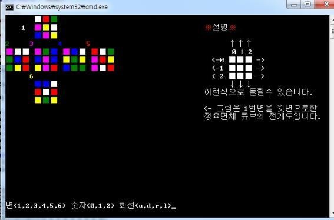
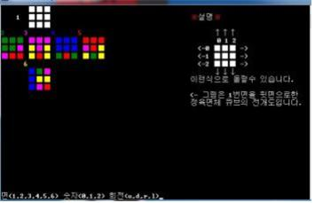
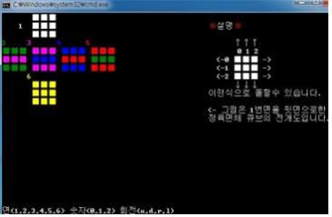
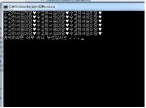

<h1>ルービックキューブの展開図をみてキューブを完成するパズルです。</h1>

大学1年生の時作りました。

面を選択し（１～６）回すところを選択し（0~2） Up, Down, Right, Leftを選択します（u,d,r,l）

例）1 1 u　

入力したらルービックキューブが回します。

最初には50回、ランダムに回します 

ルービックキューブを完成する方法に従って白い面をまず完成します。 

最後に一回残りました。 

完成です！ 

72場合の選択をいちいちしました。